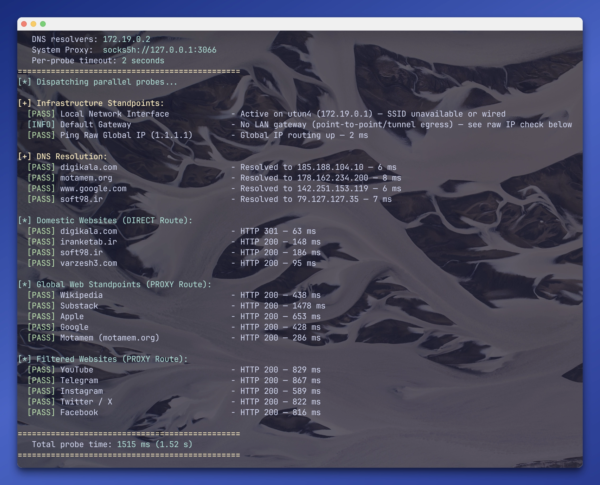

# netchecker



A fast, cross-platform internet reachability checker. Probes your local network,
DNS, and a list of domestic/global/filtered sites **in parallel**, reporting each
as `PASS` / `FAIL` / `INFO` with timings in ~1–2s. Useful behind a VPN/proxy,
where the answer differs per route.

```
===============================================
   netchecker — Network Standpoint Test
   Running Mode:  DIRECT
   Local IP:      192.168.1.6
   DNS resolvers: 192.168.1.1
===============================================

[+] Infrastructure Standpoints:
  [PASS] Local Network Interface        - Active on en0 (192.168.1.6) — Wi-Fi SSID: home
  [PASS] Ping Default Gateway (192.168.1.1) - reachable — 2 ms
  [PASS] Ping Raw Global IP (1.1.1.1)   - Global IP routing up — 4 ms

[+] DNS Resolution:
  [PASS] www.google.com                 - Resolved to 142.251.153.119 — 21 ms

[*] Domestic Websites (DIRECT Route):
  [PASS] digikala.com                   - HTTP 301 — 119 ms
```

## Install

Pick whichever fits your setup:

| Method | Command |
| --- | --- |
| **Prebuilt binary** (recommended, no compiling) | `cargo binstall netchecker` |
| Homebrew (macOS/Linux) | `brew install pourmand1376/tap/netchecker` |
| Nix | `nix run github:pourmand1376/netchecker` |
| Debian/Ubuntu | download `.deb` from [Releases](../../releases), then `sudo apt install ./netchecker_*.deb` |
| From source | `cargo install netchecker` |

`cargo binstall` needs [cargo-binstall](https://github.com/cargo-bins/cargo-binstall)
(`cargo install cargo-binstall`).

## Usage

```sh
netchecker        # auto: system proxy if set, otherwise direct
netchecker -d     # force direct — raw ISP path
netchecker -p     # force proxy
```

No prompts, safe in scripts/cron. Domestic sites always use the direct route.

## How it works

- **DNS that can't wedge** — resolves names itself via `hickory-resolver` straight
  to the nameservers over UDP/53, bypassing the OS resolver so a bad lookup fails
  fast instead of hanging every probe.
- **IP-pinned probes** — on the direct route each HTTP probe gets its pre-resolved
  IP and never calls the OS resolver. Redirects aren't followed; a `3xx` counts as
  reachable.
- **Reachability without root** — no ICMP. TCP connects race a few ports; a
  `ConnectionRefused` proves the host answered. Only failure on *every* port = down.
- **True egress detection** — finds the interface the kernel would actually use
  (via a UDP `connect` that sends nothing), correct even on split-tunnel VPNs.

## Platform support

Core (DNS bypass, HTTP probes, interface/gateway detection, TCP reachability) is
native Rust and identical on macOS, Linux, and Windows. Proxy detection uses
`scutil --proxy` on macOS plus `HTTPS_PROXY`/`ALL_PROXY`/`HTTP_PROXY` env vars
everywhere. Wi-Fi SSID is best-effort per platform and may be unavailable.

## Customising

Site lists live in [`src/sites.rs`](src/sites.rs) — edit and rebuild.

## License

MIT — see [LICENSE](LICENSE).
